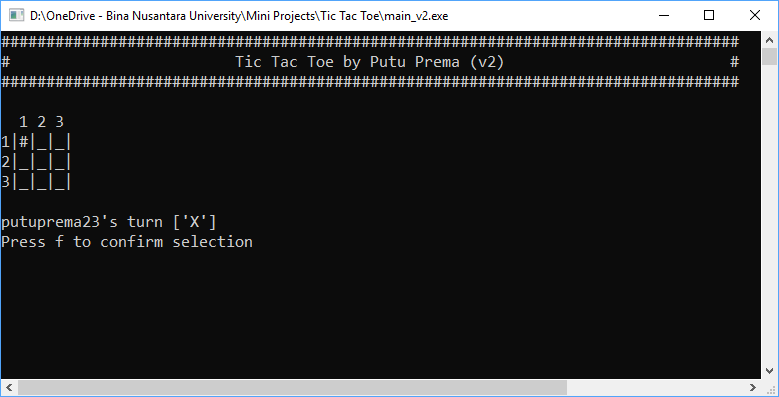

# Tic Tac Toe
Just a classic, console-based Tic Tac Toe game.

## How To Play
1. To move use key [ w | a | s | d ].
2. The program will randomly choose which player starts first.
3. The program will change the player each turn.
4. If one of the player have at least 3 X's or O's in a row either vertically or horizontally, then the player wins.
## Download
You can download the game [here](https://github.com/putuprema/tic-tac-toe/releases).
## Or build your own!
The game is made with C language. You can compile the source code using your favorite IDE (I used Dev-C++ to make the game).
